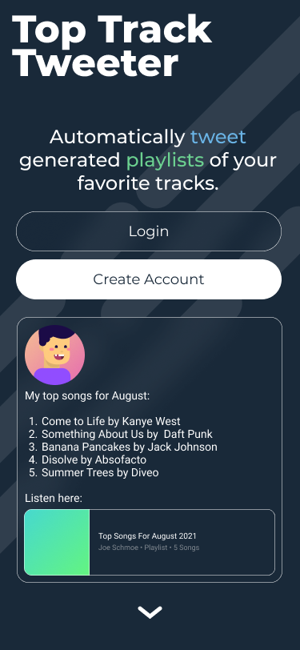
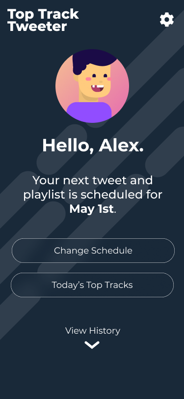
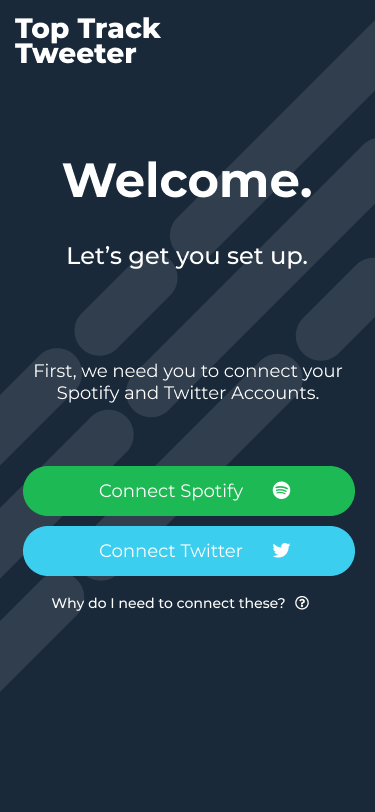
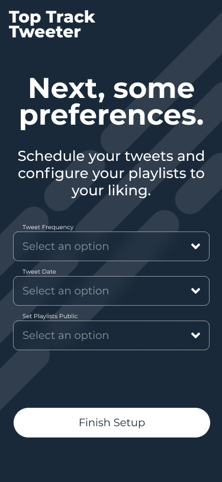
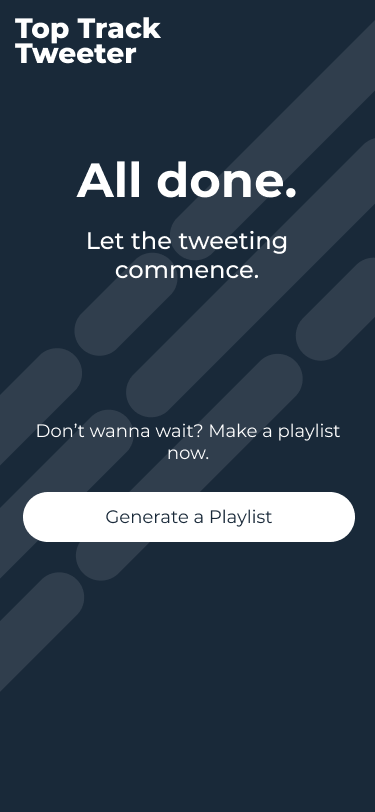
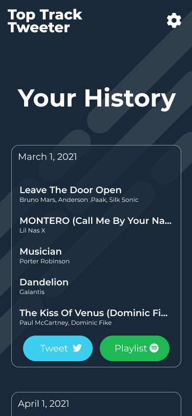

# TopTracks

>Timbre<br>
> [ˈtambər] (noun)<br>
> the character or quality of a musical sound or voice as distinct from its pitch and intensity.
---

## Architecture

Full TypeScript stack built on AWS Serverless.

This is essentially a webapp that allows users to create an account, and
schedule tweets of monthly / 6 month / yearly top tracks. The playlist link is
stored so users can look at a historical record of how their tastes have changed
over time. These playlists are then tweeted out to the user's account.

### Back - End

API processing should be built upon the ExpressJS framework.

#### Back-End Requirements

- Parsing API calls (API wrapper around spotify & twitter APIs?)
  - this has already been written in python
- Schedule playlist & tweet generation

#### Database

Firebase will be used to store user data using the following structure:

```json
{
  "0000": {
    "OauthToken": "iamatoken!!",
    "SpotifyToken": "spotifyToken!",
    "TwitterToken": "twitterToken",
    "TweetFrequency": "Weekly",
    "LastTweetDate": "1970-01-01",
    "Playlists": [
      {
        "Uri": "https://google.com",
        "CreationDate": "1970-01-01"
      }
    ]
  },
    "0002": {
    "OauthToken": "iamatoken!!",
    "SpotifyToken": "spotifyToken!",
    "TwitterToken": "twitterToken",
    "TweetFrequency": "Weekly",
    "LastTweetDate": "1970-01-01",
    "Playlists": [
      {
        "Uri": "https://google.com",
        "CreationDate": "1970-01-01"
      }
    ]
  }
}
```

#### Stretch Goals

- When generating top track playlist, also determine top genres for specified timeframe and link this to the playlist URL
- Top new tracks prediction (yes i know spotify already does this)

### Front - End
#### Figma Sketches
See: https://www.figma.com/file/pJqoFVI3t0cZN7Kuhq4zSi/Top-Track-Tweeter?node-id=0%3A1

Figma mockups can be found inside the `mockups` folder.

#### Landing Page


#### Landing Page (logged in)


#### Setup





#### History


ReactJS

#### Front-End Requirements

- Generate avatars based on uid: [https://avatars.dicebear.com/]
- Timeline animation for historical view of all playlists
